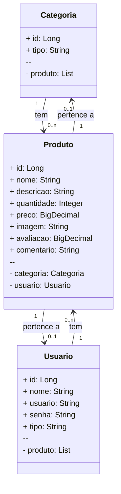

## Diagrama de classes

```mermaid
classDiagram
  class Categoria {
    + id: Long
    + tipo: String
    --
    - produto: List<Produto>
  }

  class Produto {
    + id: Long
    + nome: String
    + descricao: String
    + quantidade: Integer
    + preco: BigDecimal
    + imagem: String
    + avaliacao: BigDecimal
    + comentario: String
    --
    - categoria: Categoria
    - usuario: Usuario
  }

  class Usuario {
    + id: Long
    + nome: String
    + usuario: String
    + senha: String
    + tipo: String
    --
    - produto: List<Produto>
  }

  Categoria "1" --> "0..n" Produto : tem
  Produto "1" --> "0..1" Categoria : pertence a
  Produto "1" --> "0..1" Usuario : pertence a
  Usuario "1" --> "0..n" Produto : tem
```
